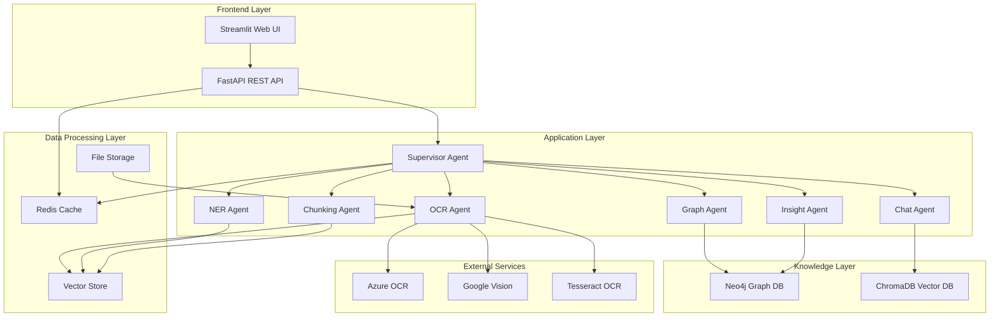
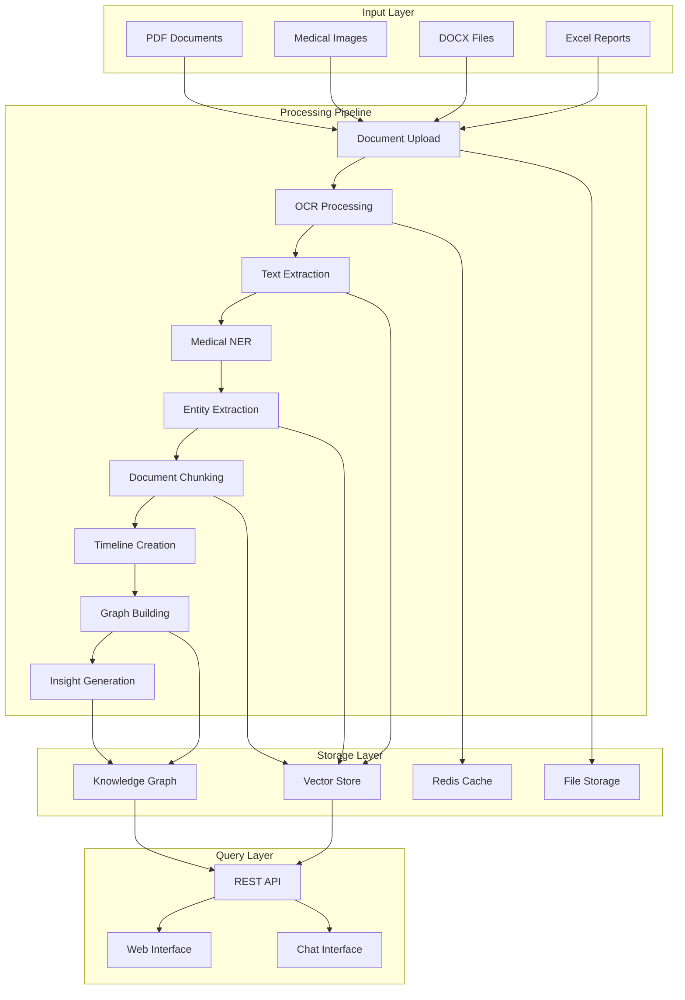
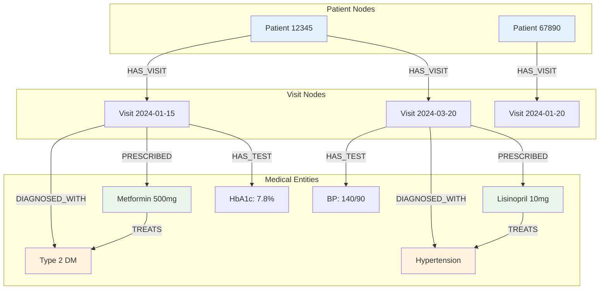
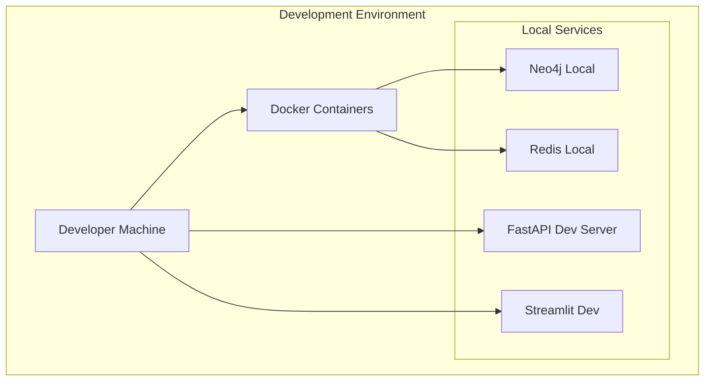

# MRIA System Architecture Documentation

## Table of Contents
1. [System Overview](#system-overview)
2. [High-Level Architecture](#high-level-architecture)
3. [Agent-Based Architecture](#agent-based-architecture)
4. [Data Flow Diagrams](#data-flow-diagrams)
5. [Technology Stack](#technology-stack)
6. [Deployment Architecture](#deployment-architecture)
7. [Security Architecture](#security-architecture)
8. [Performance & Scalability](#performance--scalability)

## System Overview

The Medical Records Insight Agent (MRIA) is an AI-powered agentic system designed to process, analyze, and extract actionable insights from diverse medical records. The system transforms unstructured medical documents into a structured knowledge graph, enabling semantic queries and medical insights.

### Key Objectives
- **Document Intelligence**: Parse diverse medical document formats (PDFs, images, Excel, DOCX)
- **Medical NLP**: Extract structured medical entities and relationships
- **Knowledge Graph**: Build temporal, connected patient health graphs
- **Semantic Search**: Enable natural language queries across patient data
- **Insight Generation**: Provide medical analytics and pattern recognition

## High-Level Architecture



## Agent-Based Architecture

### Linear Workflow Pattern

The MRIA system implements a linear supervisor-orchestrated workflow where each agent returns control to the supervisor after completion:

```mermaid
graph LR
    A[Supervisor Entry] --> B(OCR Agent)
    B --> C[Supervisor]
    C --> D(NER Agent)
    D --> E[Supervisor]
    E --> F(Chunking Agent)
    F --> G[Supervisor]
    G --> H(Graph Agent)
    H --> I[Supervisor]
    I --> J(Insight Agent)
    J --> K[Supervisor]
    K --> L(Chat Agent)
    L --> M[Supervisor End]
    
    style A fill:#e1f5fe
    style C fill:#e1f5fe
    style E fill:#e1f5fe
    style G fill:#e1f5fe
    style I fill:#e1f5fe
    style K fill:#e1f5fe
    style M fill:#e1f5fe
```



### Agent Responsibilities

#### 1. Supervisor Agent
```python
# Key Features from supervisor.py
- LangChain/LangGraph workflow orchestration
- Redis-based job queue management
- State persistence with checkpointing
- Error handling and retry logic
- Real-time progress tracking
```

**Workflow Types**:
- `OCR_ONLY`: Text extraction only
- `OCR_TO_NER`: OCR + Medical entity recognition
- `COMPLETE_PIPELINE`: Full processing pipeline
- `DOCUMENT_TO_GRAPH`: Document to knowledge graph
- `INSIGHT_GENERATION`: Generate medical insights

#### 2. OCR + Ingestion Agent
**Input Formats**: PDF, DOCX, JPG, PNG, Excel, CSV
**OCR Providers**: 
- Tesseract (open source)
- Azure Form Recognizer (cloud)
- Google Vision API (cloud)

**Processing Pipeline**:
```
Document Upload → Format Detection → OCR Processing → Text Extraction → Quality Validation
```

#### 3. Medical NER Agent
**NLP Models**:
- scispaCy: Scientific/medical spaCy models
- BioBERT: Biomedical BERT
- Med7: Medical entity recognition
- Clinical BERT: Clinical domain specialization

**Entity Types Extracted**:
- **Conditions**: "Type 2 Diabetes Mellitus"
- **Medications**: "Metformin 500mg"
- **Procedures**: "Echocardiogram"
- **Symptoms**: "Chest pain", "Shortness of breath"
- **Lab Values**: "HbA1c = 7.8%", "BP = 140/90"
- **Anatomical**: "Left ventricle", "Coronary artery"

#### 4. Chunking & Timeline Agent
**Functionality**:
- Semantic document chunking
- Temporal event structuring
- Visit-based organization
- Chronological timeline creation

**Output Structure**:
```
Visit 1 (2024-01-15):
  ├── Lab Results: HbA1c, Glucose
  ├── Medications: Metformin prescribed
  └── Diagnosis: Type 2 DM confirmed

Visit 2 (2024-03-20):
  ├── Follow-up: BP monitoring
  ├── Medication adjustment
  └── Symptoms: Improved energy
```

#### 5. Knowledge Graph Builder Agent
**Graph Schema**:
```cypher
// Core node types
(Patient)-[:HAS_VISIT]->(Visit)
(Visit)-[:DIAGNOSED_WITH]->(Condition)
(Visit)-[:PRESCRIBED]->(Medication)
(Visit)-[:HAS_TEST]->(LabResult)
(Patient)-[:HAS_CONDITION]->(Condition)
(Medication)-[:TREATS]->(Condition)
(Medication)-[:INTERACTS_WITH]->(Medication)
```

**Relationship Types**:
- `HAS_VISIT`: Patient to visit connections
- `DIAGNOSED_WITH`: Visit to condition relationships
- `PRESCRIBED`: Medication prescriptions
- `HAS_TEST`: Lab test results
- `TREATS`: Drug-condition relationships
- `INTERACTS_WITH`: Drug interactions

#### 6. Insight Agent
**Analytics Capabilities**:
- Patient progression analysis
- Treatment effectiveness assessment
- Drug interaction detection
- Care gap identification
- Population health patterns

**Insight Categories**:
```python
insight_categories = [
    "patient_summary",
    "timeline_analysis", 
    "drug_interactions",
    "care_gaps",
    "treatment_effectiveness",
    "risk_assessment"
]
```

#### 7. Query/Chat Agent
**Query Types Supported**:
- Natural language medical questions
- Patient-specific queries
- Comparative analysis requests
- Population health queries
- Temporal analysis questions

**Example Queries**:
```
"What was the treatment history for patients diagnosed with type 2 diabetes in the last 6 months?"
"Summarize this patient's progression over the last year"
"Compare this patient's history with others having the same condition"
"Show me patients with similar symptoms to chest pain and shortness of breath"
```

## Data Flow Diagrams

### Document Processing Flow



### Knowledge Graph Structure



## Technology Stack

### Core Framework Stack
```yaml
Framework:
  - FastAPI: 0.104.1          # High-performance async web framework
  - Python: 3.11+            # Modern Python with type hints
  - Uvicorn: Latest          # ASGI server
  - Pydantic: 2.5.2          # Data validation

Agent Orchestration:
  - LangChain: 0.1.0         # Agent framework
  - LangGraph: 0.0.20        # Workflow management
  - Redis: 5.0.1             # Job queue and caching

AI/ML Stack:
  - Transformers: 4.36.2     # Hugging Face models
  - SpaCy: 3.7.2             # NLP processing
  - Sentence-Transformers: 2.2.2  # Embeddings
  - scikit-learn: 1.3.2      # ML utilities
```

### Database & Storage
```yaml
Knowledge Graph:
  - Neo4j: 5.15.0            # Graph database
  - neo4j-driver: 5.15.0     # Python driver

Vector Storage:
  - ChromaDB: 0.4.22         # Vector database
  - FAISS: 1.7.4             # Similarity search

Document Processing:
  - Tesseract: pytesseract 0.3.10  # OCR
  - OpenCV: 4.8.1.78         # Image processing
  - PDF2Image: 1.16.3        # PDF conversion
  - Pillow: 10.1.0           # Image handling
```

### External Integrations
```yaml
Cloud OCR Services:
  - Azure Form Recognizer    # Microsoft cognitive services
  - Google Vision API        # Google Cloud Vision
  - AWS Textract             # Amazon document analysis

Medical NLP Models:
  - scispaCy models          # Scientific NLP
  - BioBERT                  # Biomedical BERT
  - Clinical BERT            # Clinical domain
  - Med7                     # Medical NER
```

## Deployment Architecture

### Local Development Setup


### Production Deployment Options

#### Container-Based Deployment
```yaml
version: '3.8'
services:
  mria-api:
    image: mria:latest
    ports:
      - "8080:8080"
    environment:
      - NEO4J_URI=bolt://neo4j:7687
      - REDIS_URL=redis://redis:6379
    depends_on:
      - neo4j
      - redis
      
  neo4j:
    image: neo4j:5.15.0
    ports:
      - "7474:7474"
      - "7687:7687"
    environment:
      - NEO4J_AUTH=neo4j/password
      
  redis:
    image: redis:7-alpine
    ports:
      - "6379:6379"
      
  streamlit:
    image: mria-frontend:latest
    ports:
      - "8501:8501"
    depends_on:
      - mria-api
```


### HIPAA Compliance Considerations
- **Data Encryption**: All PHI encrypted at rest and in transit
- **Access Controls**: Role-based access with audit trails
- **Data Minimization**: Only necessary medical data processed
- **Audit Logging**: Comprehensive activity tracking
- **Backup & Recovery**: Secure data backup procedures

## Performance & Scalability

### Performance Characteristics
```yaml
Processing Throughput:
  - OCR Processing: ~2-5 seconds per page
  - NER Processing: ~1-3 seconds per document
  - Graph Updates: ~100-500 nodes/second
  - Query Response: <200ms average

Scalability Targets:
  - Concurrent Users: 100+
  - Documents/Day: 10,000+
  - Knowledge Graph: 1M+ nodes
  - Vector Storage: 100K+ embeddings
```

### Scaling Strategies
1. **Horizontal Scaling**: Multiple API instances behind load balancer
2. **Async Processing**: Non-blocking I/O operations
3. **Caching**: Redis for frequently accessed data
4. **Database Optimization**: Neo4j indexing and query optimization
5. **Resource Management**: CPU/memory allocation per agent
6. **Queue Management**: Priority-based job processing

---

*This architecture documentation is maintained as part of the MRIA project and should be updated as the system evolves.*
